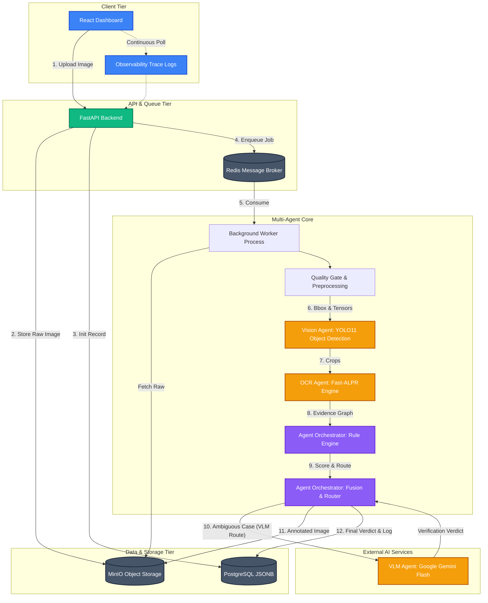

# AVIS — Automated Violation Intelligence System (Gridlock)

Detects, classifies, and documents traffic violations from **single** images. Hybrid:
deterministic CV detects; a VLM (Gemini, free tier) only *verifies* ambiguous cases and
*abstains* when a photo can't prove a violation. See [`docs/DESIGN.md`](docs/DESIGN.md)
and [`docs/ROADMAP.md`](docs/ROADMAP.md).

## Quick start (local dev — zero infra)

```bash
python -m venv .venv && .venv\Scripts\activate    # PowerShell: .venv\Scripts\Activate.ps1
pip install -r requirements.txt
cp .env.example .env                              # defaults are fine (SQLite + no VLM)
uvicorn api.main:app --reload                     # open http://127.0.0.1:8000
```

Upload a traffic image on the dashboard, or `POST /images` (multipart `file`). First run
downloads the YOLO weights automatically.

## Full stack (Postgres + Redis + MinIO)

```bash
docker compose up --build
```

## Run the checks

```bash
pytest -q            # pure unit tests (rules, scene graph) — no models needed
ruff check . && mypy core/ api/
```

## Status (vertical slice)

Implemented: upload → **quality gate** (abstain on unusable images) → **preprocessing**
(CLAHE/denoise/low-light) → YOLO detection → evidence graph → **traffic-light state** →
**Tier-A** rules (helmet, triple-riding) + **Tier-C** calibration rules (stop-line,
red-light, illegal-parking) → confidence fusion + tier-aware routing (auto-confirm / VLM /
human / abstain) → **license-plate recognition** (fast-alpr + Indian-plate regex) → legal
mapping → annotated evidence → **analytics dashboard + human-review queue (audit trail) +
searchable records**. Gemini VLM verification is wired and tested.

Tier-C rules need a camera calibration file in `configs/<camera_id>.json` (sample:
`configs/cam_demo.json`) — pass `camera_id` on upload. Wrong-side (Tier D) is intentionally
inert: a single frame can't prove direction of travel.

**Evaluation** (`python -m eval.run [dataset.json]`) — violation-level P/R/F1, a
**rule-only vs rule+VLM ablation**, plate OCR whole/char accuracy, mean latency, and the
auto/VLM/human disposition split. Add labelled images under `data/eval/` and list them in
`eval/sample_dataset.json` (include clean images with `expected: []` to measure false
positives).

## Architecture

AVIS is built as a **production-credible modular monolith**. It avoids microservice overhead while providing horizontal scalability via a robust task queue.

### 1. Three-Tier System



### 1. Multi-Agent System Architecture
The system utilizes a specialized multi-agent architecture to maximize both accuracy and performance:
- **Specialized Agents**: Tasks are divided strictly among specialized models—a **Vision Agent** (YOLO11) for fast geometric bounding boxes, an **OCR Agent** (Fast-ALPR) for reading plates, and a **VLM Agent** (Gemini) for complex visual reasoning.
- **Deterministic Orchestration**: Instead of relying on a single LLM to guess everything (which leads to hallucinations), an **Agent Orchestrator** (the Rule Engine) deterministically compiles the outputs of the sub-agents into a verifiable "Evidence Graph."
- **Cost & Latency Optimized**: The heavy, cloud-based VLM Agent is only invoked for ambiguous edge cases (like verifying red lights). 90% of clear-cut violations are solved instantly by the edge-ready Vision and OCR agents.

### 2. Three-Tier System
1. **Frontend**: A React + Vite dashboard. It features a dynamically themed Empty-State Hero dashboard, animated hardware-accelerated gradients, and real-time observability Trace Logs.
2. **API & Worker Layer**: A FastAPI application handles instant HTTP requests while a Redis-backed queue isolates and processes the heavy computer vision (CV) workloads asynchronously.
3. **Data Layer**: PostgreSQL stores structured evidence and metadata, while MinIO (S3-compatible) securely stores raw and annotated image assets.

### 3. Technology Stack
- **Core backend**: Python 3.11+, FastAPI, Pydantic, SQLModel.
- **Computer Vision**: Ultralytics YOLO11/YOLOv8 (Object Detection) & `fast-alpr` (License Plate Recognition).
- **Vision-Language Model**: Google Gemini Flash via free-tier APIs (used strictly for verification).
- **Frontend**: React 18, Vite, custom Claude-inspired CSS styling.
- **Infrastructure**: Docker Compose, PostgreSQL, MinIO, Redis.

All roadmap phases (0–6) are implemented and unit-tested (29 tests).

> Helmet detection: if `HELMET_WEIGHTS` (a fine-tuned YOLO model) is set it's used;
> otherwise, if `LLM_PROVIDER=gemini`, the Gemini vision model reads helmet status per
> rider crop (no model download needed); otherwise helmet is undetermined and routes to
> VLM/human. The `.env` here already sets `LLM_PROVIDER=gemini`, so helmet detection works
> out of the box once deps are installed.
