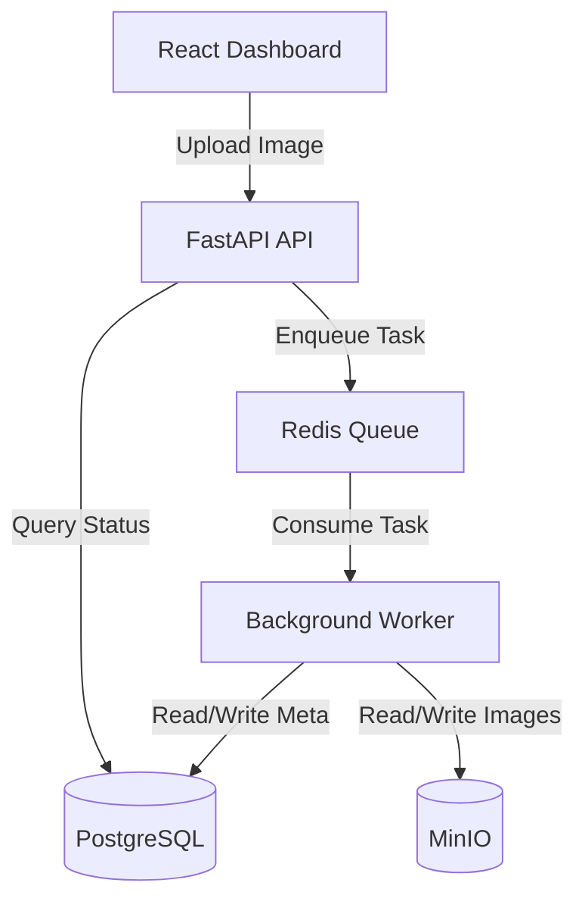

# Architecture

AVIS (Automated Violation Intelligence System) is designed as a **production-credible modular monolith**. The architecture avoids the complexity of microservices while providing true horizontal scalability using a task queue.

## 1. High-Level Architecture

The system consists of three main tiers:
1. **Frontend**: A React + Vite dashboard for uploading images, reviewing flagged violations, and analytics. It features a dynamically themed Empty-State Hero dashboard, animated hardware-accelerated gradients, and real-time observability Trace Logs.
2. **API & Worker Layer**: A FastAPI application that handles HTTP requests and a Redis-backed queue that processes the heavy computer vision (CV) workloads asynchronously.
3. **Data Layer**: PostgreSQL for structured evidence and metadata, and MinIO (S3-compatible) for raw and annotated image storage.

## 2. Technology Stack

### Core Frameworks
- **Backend**: Python 3.11+, FastAPI, Uvicorn, Pydantic, SQLModel.
- **Frontend**: React, Vite, Chart.js.
- **Database**: PostgreSQL (JSONB for unstructured evidence graphs) via `psycopg`.
- **Object Storage**: MinIO.
- **Message Broker**: Redis (for background task queues).

### ML & AI Components
- **Object Detection**: Ultralytics YOLO11/YOLOv8 (runs on CPU/GPU). Detects vehicles, persons, and traffic lights.
- **License Plate Recognition (ALPR)**: `fast-alpr` with ONNX runtime for detection and OCR.
- **Vision-Language Model (VLM)**: Google Gemini Flash (free tier via `google-genai`), used strictly as a verification and fallback layer for ambiguous cases.

### Infrastructure & Deployment
- **Orchestration**: Docker Compose (`docker-compose.yml`) stands up the entire production-like environment (Postgres, Redis, MinIO, API).
- **Local Dev Mode**: A fast, zero-infra mode is supported using SQLite (instead of Postgres) and in-process background tasks (instead of Redis).

## 3. Scalability Path

The monolith is built to scale out horizontally without architectural rewrites:
- **API Nodes**: Stateless, can be scaled out behind a load balancer.
- **CV Workers**: The heaviest workload (YOLO detection, OCR) is isolated to background workers consuming from Redis. Scaling means adding more worker nodes (potentially with GPUs).
- **Storage**: MinIO can be seamlessly replaced by AWS S3; PostgreSQL can be moved to a managed service like AWS RDS.
- **VLM API Limits**: The VLM is called sparingly (only for ambiguous cases), avoiding rate limits and keeping operational costs near zero. Results are hashed and cached to prevent redundant API calls.

## 4. Key Design Patterns

- **Evidence Graph**: A typed graph structure representing detections (nodes) and their relationships (edges, e.g., `rides`, `has_plate`). This provides an explainable basis for the rules engine.
- **Deterministic Rule Engine**: Rules (like "triple riding") are pure functions evaluating the Evidence Graph. No ML is used for the *reasoning* step, making it 100% predictable and unit-testable.
- **Confidence Fusion**: A mechanism to blend raw detection confidence, rule evidence, and VLM confidence into a single actionable score.
