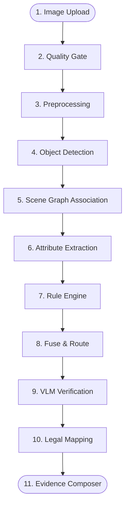

# Data Flow Documentation

The AVIS data pipeline operates sequentially, passing an `EvidenceGraph` through 10 distinct processing stages. This ensures determinism and maintainability.

## Pipeline Architecture

The pipeline logic is executed by a background worker (or in-process runner) defined in `core/pipeline/`.

## Stage Descriptions

### 1. Ingestion
The image is received via the FastAPI endpoint (`POST /images`). It is saved to MinIO, and a metadata record is created in PostgreSQL with status `pending`.

### 2. Quality Gate (`core/quality/`)
Analyzes the image using OpenCV.
- Checks image resolution.
- Checks variance of Laplacian (for blur).
- Checks pixel intensity histograms (for extreme under/overexposure).
If the image fails, processing halts, and status becomes `undeterminable`.

### 3. Preprocessing (`core/preprocess/`)
Enhances the image non-destructively (original remains untouched).
- Applies CLAHE (Contrast Limited Adaptive Histogram Equalization).
- Reduces noise.
Output: A normalized image matrix passed to the detector.

### 4. Detection (`core/detect/`)
Ultralytics YOLOv8/11 models process the image.
- Identifies bounding boxes for vehicles, persons, and traffic lights.
- Generates raw `Detection` objects.

### 5. Scene Graph (`core/graph/`)
Converts raw detections into semantic relationships.
- Uses Intersection over Union (IoU) and bounding box geometry.
- Associates riders to motorcycles (`rides` edge).
- Associates drivers to cars (`drives` edge).
Output: An initialized `EvidenceGraph`.

### 6. Attribute Classifiers (`core/attributes/`)
Extracts localized details from crops.
- Evaluates helmet presence on riders.
- Uses `fast-alpr` to crop license plates and run OCR.
- Evaluates traffic light state (Red/Amber/Green).

### 7. Rule Engine (`core/rules/`)
Deterministic functions evaluate the `EvidenceGraph` to find violations.
- Example: The Triple Riding rule checks if a motorcycle node has > 2 `rides` edges.
- Creates `Candidate` objects with a rule-evidence score and assigns a Tier.

### 8. Fuse & Route (`core/pipeline/`)
Calculates a fused confidence score based on detection, attribute, and rule scores.
Assigns a routing action: `auto_confirmed`, `vlm_confirmed`, or `human_review`.

### 9. VLM Verify (`core/llm/`)
Triggered ONLY if the route is `vlm_confirmed`.
- Constructs a prompt and sends the specific image crop to the Vision-Language Model.
- Parses the JSON response to either confirm the violation or change the route to `abstain`/`human_review`.

### 10. Legal Mapping (`core/legal/`)
Deterministic lookup. Maps the violation type (e.g., `HELMET_NON_COMPLIANCE`) to the Indian Motor Vehicles Act section and assigns the corresponding fine amount.

### 11. Evidence Composer
Finalizes the output.
- Generates an annotated image overlay (bounding boxes, reasons, plate info).
- Computes a SHA-256 hash of the original image for tamper evidence.
- Saves the final `Violation` JSON document to PostgreSQL.
